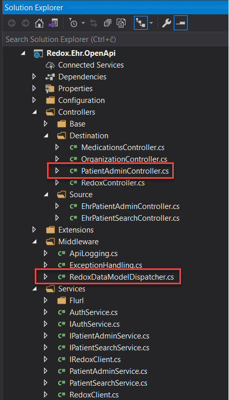

# Redox.Ehr.OpenApi.Demo

## Introduction
Due to the needs of one of our clients, I had to research Redox Engine and as a result, this demo was created. It shows how consume [Redox APIs](https://developer.redoxengine.com/) from a custom EHR WebAPI. Two-way communication is supported, from source EHR system to Redox and vice versa.

## What is Redox?
From their documentation, [Redox](https://www.redoxengine.com/product/) is a platform for healthcare products and services to integrate to any provider EHR. It’s healthcare integration as a service presented as a single, standard, secure API endpoint, eliminating infrastructure requirements, data transformation tasks, and security overhead of bespoke integration methods. One connection to [Redox](https://www.redoxengine.com/product/) speeds customer acquisition and increases developer productivity.

## Let’s start
Solution exists from three projects:
* Redox.Ehr.Contracts
* Redox.Ehr.Core
* Redox.Ehr.OpenApi

### Redox.Ehr.Contracts
This is a class library with Dto and Redox domain models. How to generate Redox models is described [here](https://github.com/matjazbravc/Redox.DataModel.Builder).

### Redox.Ehr.Core
This is a class library with common classes like exceptions, extensions, etc.

### Redox.Ehr.OpenApi
This is a OpenApi project with two kind of controllers: source and destination. Source controllers are communication endpoints for source EHR system which sends EHR Dto objects to those endpoints. EHR Dto models are converted to Redox models and sent to Redox API endpoint.
Destination controllers are used for communication from Redox API to source EHR system.
## **NOTE:
Not all Redox data models/event types are supported, just add them as you wish!

## Application as a Source
Sources can be described as the entity that is sending data into Redox. We have to configure and authenticate a source. That's why we have to initialize a Redox Client object using our API key and secret from our Redox source record.
```csharp
using Flurl;
using Flurl.Http;
using Microsoft.Extensions.Logging;
using Microsoft.Extensions.Options;
using Newtonsoft.Json;
using Newtonsoft.Json.Linq;
using Redox.DataModel.Builder.Configuration;
using Redox.Ehr.OpenApi.Extensions;
using System;
using System.Threading.Tasks;

namespace Redox.Ehr.OpenApi.Services
{
    /// <summary>
    /// HTTP Client for accessing Redox API
    /// </summary>
    public class RedoxClient : IRedoxClient
    {
        private readonly RedoxApiConfig _config;
        private readonly ILogger<RedoxClient> _logger;

        public RedoxClient(ILogger<RedoxClient> logger, IOptions<RedoxApiConfig> config)
        {
            _logger = logger;
            _config = config.Value;
        }

        public async Task<T> PostAsync<T>(object data) where T : new()
        {
            _logger.LogDebug(nameof(PostAsync));
            var jsonQuery = GetJsonObject(data);

            var response = await _config.BaseUrl
                .AppendPathSegments(_config.EndpointSegment)
                .WithAuthentication()
                .PostJsonAsync(jsonQuery);

            T result = default;
            if (response.ResponseMessage.IsSuccessStatusCode)
            {
                result = await response.GetJsonAsync<T>();
            }

            return result;
        }

        public async Task<T> QueryAsync<T>(object data) where T : new()
        {
            _logger.LogDebug(nameof(QueryAsync));
            var jsonQuery = GetJsonObject(data);

            var response = await _config.BaseUrl
                .AppendPathSegments(_config.QuerySegment)
                .WithAuthentication()
                .WithTimeout(TimeSpan.FromSeconds(120))
                .PostJsonAsync(jsonQuery);

            T result = default;
            if (response.ResponseMessage.IsSuccessStatusCode)
            {
                result = await response.GetJsonAsync<T>();
            }

            return result;
        }

        private static JObject GetJsonObject(object data)
        {
            // Serialize query to string
            var stringQuery = JsonConvert.SerializeObject(data);

            // Populate Json Object
            var jsonQuery = JObject.Parse(stringQuery);
            return jsonQuery;
        }
    }
}
```


Source controllers currently support only **PatientAdmin/Newpatient** and **PatientSearch/Query** data model/event types. But you can add new data models/event types anytime. Sending a new patient example:


All important settings are configurable and located in **appsettings.json** file.  
**Important: API key and secret should be stored in a secured storage like [Azure Key Vault](https://docs.microsoft.com/en-us/aspnet/core/security/key-vault-configuration?view=aspnetcore-5.0)!**
```json
{
  "RedoxApiConfig": {
    "Key": "YOUR API KEY",
    "Secret": "YOUR SECRET",
    "BaseUrl": "https://api.redoxengine.com/",
    "AuthenticateSegment": "auth/authenticate",
    "RefreshTokenSegment": "auth/refreshToken",
    "EndpointSegment": "endpoint",
    "QuerySegment": "query",
    "PatientSearch_Destination_ID": "0f4bd1d1-451d-4351-8cfd-b767d1b488d6",
    "PatientSearch_Destination_Name": "Patient Search Endpoint",
    "PatientAdmin_Destination_ID": "af394f14-b34a-464f-8d24-895f370af4c9",
    "PatientAdmin_Destination_Name": "Redox EMR",
    "RedoxDestinationControllerPath": "api/redox",
    "RedoxDestinationVerificationSegment": "verifydestination",
    "RedoxDestinationVerificationToken": "YOUR VERIFICATION TOKEN"
  },
  "Logging": {
    "LogLevel": {
      "Default": "Information",
      "Microsoft": "Warning",
      "Microsoft.Hosting.Lifetime": "Information"
    }
  },
  "AllowedHosts": "*"
}
```

## Application as a Destination
Destinations can be described as the entity (endpoint) that is receiving data from Redox. To receive pushed data from an EHR, we will need to configure and authenticate (verificate) our destination.

### Local setup
To be able send a web request to our local machine we have to use [ngrok](https://ngrok.com/) tool to set up a secure tunnel from local machine to randomly generated Url on the public web. For this purpose we have to execute the following command:
**ngrok http 56058 -host-header="localhost:56058"**

In the next step we will set up Redox destination with the ngrok Url and postfix **/api/redox** which is our destination endpoint. Click the **Verify & Save** button and see that the destination is verified and set up.


## Test Destination
To test a destinaton we can use DevTools to send a **PatientAdmin^NewPatient** message to our destination:


Now follows interesting part. As you can see in Solution explorer there is **PatientAdminController** which handles PatientAdmin event types: **Arrival**, **Cancel**, **NewPatient** and **PatientUpdate**.

```csharp
using Microsoft.AspNetCore.Authorization;
using Microsoft.AspNetCore.Cors;
using Microsoft.AspNetCore.Mvc;
using Microsoft.Extensions.Logging;
using Microsoft.Extensions.Options;
using Redox.DataModel.Builder.Configuration;
using Redox.Ehr.Contracts.Models.Redox.Patientadmin.Arrival;
using Redox.Ehr.Contracts.Models.Redox.Patientadmin.Cancel;
using Redox.Ehr.Contracts.Models.Redox.Patientadmin.Newpatient;
using Redox.Ehr.Contracts.Models.Redox.Patientadmin.Patientupdate;
using Redox.Ehr.OpenApi.Controllers.Base;

namespace Redox.Ehr.OpenApi.Controllers.Destination
{
    /// <summary>
    /// Redox DESTINATION OpenAPI controller
    /// </summary>
    [AllowAnonymous]
    [ApiController]
    [ApiExplorerSettings(IgnoreApi = true)]
    [Produces("application/json")]
    [EnableCors("EnableCORS")]
    [Route("api/[controller]")]
    public class PatientAdminController : BaseController<PatientAdminController>
    {
        private readonly RedoxApiConfig _config;

        public PatientAdminController(IOptions<RedoxApiConfig> config)
        {
            _config = config.Value;
        }

        [HttpPost("Arrival")]
        [ProducesResponseType(200)]
        [ProducesResponseType(404)]
        public IActionResult Arrival([FromBody] Arrival patient)
        {
            Logger.LogDebug(nameof(Arrival));
            if (!IsAuthenticated())
            {
                return BadRequest();
            }

            // TODO: A patient shows up for their visit/a patient is admitted to the hospital. Not implemented, yet.

            return Ok();
        }

        [HttpPost("Cancel")]
        [ProducesResponseType(200)]
        [ProducesResponseType(404)]
        public IActionResult Cancel([FromBody] Cancel patient)
        {
            Logger.LogDebug(nameof(Cancel));
            if (!IsAuthenticated())
            {
                return BadRequest();
            }

            // TODO: A PatientAdmin event is canceled. Not implemented, yet.

            return Ok();
        }

        [HttpPost("NewPatient")]
        [ProducesResponseType(200)]
        [ProducesResponseType(404)]
        public IActionResult NewPatient([FromBody] Newpatient patient)
        {
            Logger.LogDebug(nameof(NewPatient));
            if (!IsAuthenticated())
            {
                return BadRequest();
            }

            // TODO: A new patient has been created in the source EHR system. Not implemented, yet.

            return Ok();
        }

        [HttpPost("PatientUpdate")]
        [ProducesResponseType(200)]
        [ProducesResponseType(404)]
        public IActionResult PatientUpdate([FromBody] Patientupdate patient)
        {
            Logger.LogDebug(nameof(PatientUpdate));
            if (!IsAuthenticated())
            {
                return BadRequest();
            }

            // TODO: A patient or registration information changed while the patient is not currently admitted. Not implemented, yet.

            return Ok();
        }
    }
}
```
If we will send **Organization^New** message, request will call **OrganizationController**, etc. **RedoxController** is used only for a validating destination.
To be able redirect requests from Redox to our destination controller according to data model, I've created special **RedoxDataModelDispatcher** middleware which intercepts all requests and dispatch modified request to appropriate controllers/enpoints.
```csharp
using Microsoft.AspNetCore.Http;
using Microsoft.Extensions.Logging;
using Microsoft.Extensions.Options;
using Newtonsoft.Json.Linq;
using Redox.DataModel.Builder.Configuration;
using Redox.Ehr.Core.Extensions;
using System.IO;
using System.Text;
using System.Threading.Tasks;

namespace Redox.Ehr.OpenApi.Middleware
{
    /// <summary>
    /// Middleware for Redox action redirection
    /// </summary>
    public class RedoxDataModelDispatcher : IMiddleware
    {
        private readonly ILogger _logger;
        private readonly RedoxApiConfig _config;

        public RedoxDataModelDispatcher(IOptions<RedoxApiConfig> config, ILoggerFactory loggerFactory)
        {
            _config = config.Value;
            _logger = loggerFactory.CreateLogger<RedoxDataModelDispatcher>();
        }

        public async Task InvokeAsync(HttpContext context, RequestDelegate next)
        {
            var path = context.Request.Path.Value;
            _logger.LogInformation($"Request from: {path}");

            // Rewrite to index
            if (path.Contains(_config.RedoxDestinationControllerPath))
            {
                // Ensure the requestBody can be read multiple times
                context.Request.EnableBuffering();

                // Leave the body open so the next middleware can read it.
                using var reader = new StreamReader(
                    context.Request.Body,
                    encoding: Encoding.UTF8,
                    detectEncodingFromByteOrderMarks: false,
                    bufferSize: 1024 * 45,
                    leaveOpen: true);
                var body = await reader.ReadToEndAsync().ConfigureAwait(false);
                var jsonBody = JObject.Parse(body);

                // Redox verification request?
                var verification_token = (string)jsonBody.SelectToken("verification-token");
                if (!string.IsNullOrWhiteSpace(verification_token))
                {
                    // Rewrite request path to navigate to verify destination endpoint
                    context.Request.Path = string.Concat("/", _config.RedoxDestinationControllerPath.AppendToUrl(_config.RedoxDestinationVerificationSegment));
                }
                else
                {
                    // It's a Data Model
                    var dataModel = (string)jsonBody.SelectToken("Meta.DataModel");
                    var eventType = (string)jsonBody.SelectToken("Meta.EventType");
                    if (!string.IsNullOrEmpty(dataModel) && !string.IsNullOrEmpty(eventType))
                    {
                        // Create a controller and method name from DataModel and EventType and rewrite request path
                        // NOTE: Controller/Method must exists!
                        context.Request.Path = string.Concat("/api/", $"{dataModel}/{eventType}");
                    }
                }

                // Reset the request body stream position so the next middleware can read it
                context.Request.Body.Seek(0, SeekOrigin.Begin);
            }

            await next(context).ConfigureAwait(false);
        }
    }
}
```
With this approach we can easy dispatch data models/event types to proper destination controllers and the whole architecture looks much cleaner.

## Conclusion
For anyone coming from the .NET Core world, the experience with Redox was quite a challenge as there were no examples to demonstrate the usage.
However, due to the flexibility of .NET Core technology and good documentation this was not difficult to implement.
  
Despite the lack of time, I’m satisfied with the experience, I really liked it. Try it for yourself!

## Prerequisites
- [Visual Studio](https://www.visualstudio.com/vs/community) 2019 16.8.1 or greater 

## Tags, technologies and sources
- [Redox Engine](https://www.redoxengine.com/product/)
- [Redox Blog](https://www.redoxengine.com/blog/)
- [Redox Engine Developer Guide](https://developer.redoxengine.com/)  
- [ngrok](https://ngrok.com/) - exposes local servers behind firewalls to the public internet over secure tunnels
- [Flurl](https://flurl.dev/) - fluent, asynchronous, testable, portable HTTP client library for .NET

For any questions/suggestions contact me on [LinkedIn](https://si.linkedin.com/in/matjazbravc).
